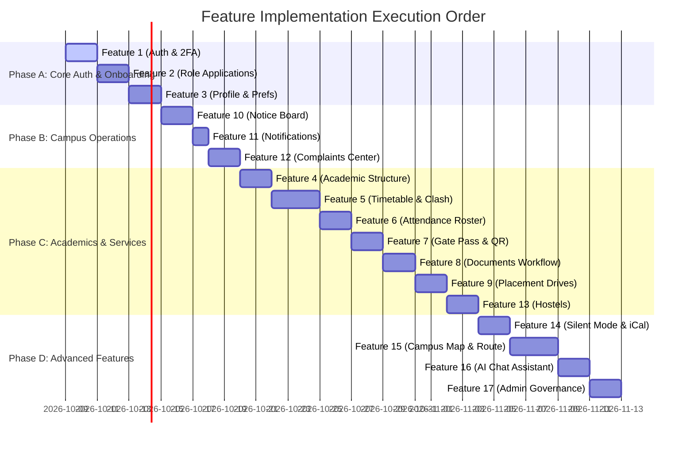

# BPUT CMS — Feature-Wise API Mapping Specification

Version 1.0 | October 2026 | Status: Complete API Architecture Specification

> **Note on API Redundancy:** APIs are listed under **every feature** where they are consumed. For example, `GET /api/metadata/departments` appears in *Onboarding*, *Academic Infrastructure*, *Notice Creation*, and *Placement Eligibility* because all of those UI features consume department data.

---

## Table of Feature Modules

1. [Feature 1: User Authentication, 2FA & Security](#feature-1-user-authentication-2fa--security) ✅ 
2. [Feature 2: Account Onboarding & Role Application Wizard]     (#feature-2-account-onboarding--role-application-wizard) 
3. [Feature 3: Dynamic User Profile & Personal Preferences](#feature-3-dynamic-user-profile--personal-preferences)
4. [Feature 4: Academic Infrastructure & Department Setup](#feature-4-academic-infrastructure--department-setup)
5. [Feature 5: Weekly Timetable Scheduling & Clash Detection](#feature-5-weekly-timetable-scheduling--clash-detection)
6. [Feature 6: Class Attendance Marking & Shortage Tracking](#feature-6-class-attendance-marking--shortage-tracking)
7. [Feature 7: Student Gate Pass System & Security Scanner](#feature-7-student-gate-pass-system--security-scanner)
8. [Feature 8: Multi-Step Document Request & Verification](#feature-8-multi-step-document-request--verification)
9. [Feature 9: Placement Drives & Student Applications](#feature-9-placement-drives--student-applications)
10. [Feature 10: Digital Notice Board & Audience Targeting](#feature-10-digital-notice-board--audience-targeting)
11. [Feature 11: In-App Notification Center & Alert Bell](#feature-11-in-app-notification-center--alert-bell)
12. [Feature 12: Complaint Resolution Center & Issue Analytics](#feature-12-complaint-resolution-center--issue-analytics)
13. [Feature 13: Hostel Management & Student Room Allocation](#feature-13-hostel-management--student-room-allocation)
14. [Feature 14: Personal Silent Mode & iCal Calendar Feed](#feature-14-personal-silent-mode--ical-calendar-feed)
15. [Feature 15: Campus Map & Dijkstra Shortest Path Navigation](#feature-15-campus-map--dijkstra-shortest-path-navigation)
16. [Feature 16: BPUT Campus AI Assistant Chat Drawer](#feature-16-bput-campus-ai-assistant-chat-drawer)
17. [Feature 17: SuperAdmin Governance, RBAC Matrix & Maintenance Control](#feature-17-superadmin-governance-rbac-matrix--maintenance-control)

---

## Feature 1: User Authentication, 2FA & Security

### Overview & UI Views
Provides secure entry into the application. Includes login form, password verification, 2FA OTP modal, open self-registration, and token auto-refresh.

- **UI Views:** `/login`, `/register`, `/verify-2fa` modal, `/reset-password`

### Endpoints Consumed

| Endpoint | Method | Specific Purpose in this Feature | Auth / Perm Required |
| :--- | :--- | :--- | :--- |
| `/api/auth/login` | `POST` | Authenticates email & password. Returns JWT tokens or triggers 2FA modal (`requires_2fa: true`). | Public |
| `/api/auth/login/verify-2fa` | `POST` | Validates 6-digit OTP code when 2FA is enforced during login. Returns access & refresh tokens. | Public (Session Token) |
| `/api/auth/refresh` | `POST` | Exchanges valid refresh token for a new short-lived access token. | Public (Refresh Token) |
| `/api/auth/me` | `GET` | Fetches active logged-in user profile, role, account status (`base`, `pending`, `active`), and RBAC permissions. | Bearer Token |
| `/api/auth/check-email` | `GET` | Real-time email uniqueness validator on registration form keypress. | Public |
| `/api/auth/register` | `POST` | Open registration for new accounts (sets `account_status: base`). | Public |
| `/api/settings/public` | `GET` | Reads security settings (min password length, 2FA enforcement policy). | Public |

---

## Feature 2: Account Onboarding & Role Application Wizard

### Overview & UI Views
New users (`account_status: base`) select their role (Student, Faculty, Staff, Parent) and fill out profile credentials for admin approval.

- **UI Views:** `/apply-role`, `/onboarding/status`, Admin `/admin/applications`

### Endpoints Consumed

| Endpoint | Method | Specific Purpose in this Feature | Auth / Perm Required |
| :--- | :--- | :--- | :--- |
| `/api/metadata/departments` *(Redundant)* | `GET` | Populates Department dropdown selection in Student/Faculty/Staff role forms. | Bearer Token |
| `/api/metadata/courses` *(Redundant)* | `GET` | Populates Course dropdown selection for Student role applications. | Bearer Token |
| `/api/metadata/roles` *(Redundant)* | `GET` | Fetches list of available assignable system roles. | Bearer Token |
| `/api/applications/check-identifier` | `GET` | Checks if Registration No (Student) or Employee ID (Faculty/Staff) is already registered before submit. | Bearer Token |
| `/api/applications` | `POST` | Submits role application (updates user status to `pending`). | Bearer Token |
| `/api/applications` | `GET` | Displays student's own submitted application status (`PENDING`, `APPROVED`, `REJECTED`). | Bearer Token |
| `/api/applications/{id}/approve` | `POST` | **Admin Action:** Approves role application, creates typed profile (`StudentProfile`), sets status to `active`. | `role_application:approve` |
| `/api/applications/{id}/reject` | `POST` | **Admin Action:** Rejects role application with review note, reverts user status to `base`. | `role_application:reject` |

---

## Feature 3: Dynamic User Profile & Personal Preferences

### Overview & UI Views
Allows users to upload avatars, change passwords, toggle notification preferences, and request email updates with OTP verification.

- **UI Views:** `/profile`, `/settings/preferences`

### Endpoints Consumed

| Endpoint | Method | Specific Purpose in this Feature | Auth / Perm Required |
| :--- | :--- | :--- | :--- |
| `/api/auth/me` *(Redundant)* | `GET` | Loads current user profile metadata, current avatar URL, and user details. | Bearer Token |
| `/api/users/me/photo` | `POST` | Uploads avatar image file to Supabase `avatars` bucket and saves URL. | Bearer Token |
| `/api/users/me/name` | `PATCH` | Updates user display name. | Bearer Token |
| `/api/users/me/password` | `POST` | Changes user account password with old password verification. | Bearer Token |
| `/api/users/me/preferences` | `PATCH` | Toggles `email_notifications` and `in_app_alerts` flags. | Bearer Token |
| `/api/users/me/email/request` | `POST` | Triggers OTP verification email to request new email address. | Bearer Token |
| `/api/users/me/email/verify` | `POST` | Verifies OTP code and updates user's primary email address. | Bearer Token |
| `/api/users/me/2fa/enable-request` | `POST` | Generates 2FA setup OTP sent via email. | Bearer Token |
| `/api/users/me/2fa/enable-verify` | `POST` | Confirms 2FA setup and enables two-factor authentication on account. | Bearer Token |
| `/api/users/me/2fa/disable` | `POST` | Disables two-factor authentication on user account. | Bearer Token |

---

## Feature 4: Academic Infrastructure & Department Setup

### Overview & UI Views
Admin & HOD management of academic organizational structure: departments, courses, academic terms, subjects, class group cohorts, and holiday calendars.

- **UI Views:** `/academic/departments`, `/academic/courses`, `/academic/terms`, `/academic/subjects`, `/academic/class-groups`, `/academic/holidays`

### Endpoints Consumed

| Endpoint | Method | Specific Purpose in this Feature | Auth / Perm Required |
| :--- | :--- | :--- | :--- |
| `/api/academic/departments` *(Redundant)* | `GET` / `POST` | List and create academic & administrative departments. | `academic:manage` |
| `/api/academic/courses` *(Redundant)* | `GET` / `POST` | List and create degree courses (B.Tech, M.Tech, MBA). | `academic:manage` |
| `/api/academic/terms` | `GET` / `POST` | Manage academic terms/semesters and set `is_current` active term. | `academic:manage` |
| `/api/academic/subjects` | `GET` / `POST` | Manage subject catalog (code, name, department, credit hours). | `academic:manage` |
| `/api/academic/class-groups` | `GET` / `POST` | Manage student cohorts (course, department, year, section). | `academic:manage` |
| `/api/academic/holidays` | `GET` / `POST` | Manage holiday calendar dates affecting timetable and attendance. | `academic:manage` |
| `/api/admin/users` *(Redundant)* | `GET` | Select HOD faculty user from dropdown when configuring department. | `user:list` |

---

## Feature 5: Weekly Timetable Scheduling & Clash Detection

### Overview & UI Views
Visual weekly timetable grid for students and faculty. Features automatic multi-resource clash detection (faculty, classroom, cohort) and exception overrides.

- **UI Views:** `/timetable`, `/timetable/manage`, `/timetable/exceptions`

### Endpoints Consumed

| Endpoint | Method | Specific Purpose in this Feature | Auth / Perm Required |
| :--- | :--- | :--- | :--- |
| `/api/timetable/mine` | `GET` | Fetches personalized weekly slot schedule for current logged-in student/faculty. | `timetable:list` |
| `/api/timetable/slots` | `GET` / `POST` | List and create recurring weekly slots. Checks room, faculty, and cohort clashes. | `timetable:create` |
| `/api/timetable/exceptions` | `GET` / `POST` | Add single-day slot overrides (CANCELLED, SUBSTITUTE, EXTRA class). | `timetable:edit` |
| `/api/map/locations` *(Redundant)* | `GET` | Populates Classroom / Lab room location dropdown from campus map directory. | `map:view` |
| `/api/academic/subjects` *(Redundant)* | `GET` | Populates Subject dropdown selection when creating timetable slot. | `academic:manage` |
| `/api/academic/class-groups` *(Redundant)* | `GET` | Populates Target Class Group cohort selection. | `academic:manage` |
| `/api/admin/users` *(Redundant)* | `GET` | Populates Assigned Faculty teacher dropdown list. | `user:list` |

---

## Feature 6: Class Attendance Marking & Shortage Tracking

### Overview & UI Views
Faculty mark daily class attendance. Features automated edit window countdown lock, subject-wise percentage reports, and automated shortage alerts.

- **UI Views:** `/attendance/mark`, `/attendance/reports`, `/attendance/my-stats`

### Endpoints Consumed

| Endpoint | Method | Specific Purpose in this Feature | Auth / Perm Required |
| :--- | :--- | :--- | :--- |
| `/api/timetable/mine` *(Redundant)* | `GET` | Shows faculty today's scheduled class slots available for taking attendance. | `timetable:list` |
| `/api/attendance/sessions` | `POST` | Opens an attendance session for a class slot and locks after configured window. | `attendance:mark` |
| `/api/attendance/records` | `POST` / `PUT` | Submits/updates student present/absent roster status. | `attendance:mark` |
| `/api/attendance/mine/stats` | `GET` | Displays student's own subject-wise attendance percentage & shortage warning indicator. | `attendance:view` |
| `/api/settings/public` *(Redundant)* | `GET` | Reads minimum required attendance percentage (e.g. 75%) for alert threshold. | Public |

---

## Feature 7: Student Gate Pass System & Security Scanner

### Overview & UI Views
Student outpass request flow for Short (tea/market) and Long (holiday/leave) passes. Generates digital QR codes scanned at security gate terminals.

- **UI Views:** `/gate-pass/request`, `/gate-pass/my-passes`, Security `/gate-pass/scan`

### Endpoints Consumed

| Endpoint | Method | Specific Purpose in this Feature | Auth / Perm Required |
| :--- | :--- | :--- | :--- |
| `/api/gate-pass` | `POST` | Submits short or long gate pass request with destination & times. | `gate_pass:request_short` / `request_long` |
| `/api/gate-pass` | `GET` | Fetches student's pass history and active approved pass. | `gate_pass:view` |
| `/api/gate-pass/{id}/cancel` | `PATCH` | Cancels pending or unused pass. | `gate_pass:cancel` |
| `/api/gate-pass/{id}/approve` | `POST` | **Warden/HOD Action:** Approves request and generates unique `pass_code` & QR. | `gate_pass:approve_short` / `approve_long` |
| `/api/gate-pass/{id}/reject` | `POST` | **Warden/HOD Action:** Rejects gate pass request with review note. | `gate_pass:approve_short` / `approve_long` |
| `/api/gate-pass/scan` | `POST` | **Security Terminal Action:** Scans QR/Pass Code to record exact OUT and RETURN timestamps. | `gate_pass:mark_exit` / `mark_entry` |

---

## Feature 8: Multi-Step Document Request & Verification

### Overview & UI Views
Students apply for official documents (Bonafide, NOC, Transcript). Approvers process sequential steps before PDF issuance with verification QR code.

- **UI Views:** `/documents/apply`, `/documents/my-requests`, `/documents/approvals`, Public `/verify-document/{code}`

### Endpoints Consumed

| Endpoint | Method | Specific Purpose in this Feature | Auth / Perm Required |
| :--- | :--- | :--- | :--- |
| `/api/documents/types` | `GET` / `POST` | List available document types and dynamic form field schemas. | `document:view_types` |
| `/api/documents/requests` | `POST` | Submits document request with dynamic JSON form data. | `document:apply` |
| `/api/documents/requests` | `GET` | Displays user's document requests and current step approval status (`IN_REVIEW`, `ISSUED`). | `document:view` |
| `/api/documents/requests/{id}/approve` | `POST` | **Approver Action:** Approves current step or issues final PDF with QR code. | `document:approve` |
| `/api/documents/verify/{code}` | `GET` | **Public Action:** Scans QR code to verify document authenticity against database record. | Public |

---

## Feature 9: Placement Drives & Student Applications

### Overview & UI Views
Placement Officer posts campus hiring notices with strict eligibility criteria (min CGPA, course, department, passout year). Eligible students apply with resume upload.

- **UI Views:** `/placements/drives`, `/placements/apply`, Officer `/placements/manage`

### Endpoints Consumed

| Endpoint | Method | Specific Purpose in this Feature | Auth / Perm Required |
| :--- | :--- | :--- | :--- |
| `/api/placements/notices` | `GET` / `POST` | List published job drives and create new placement notices. | `placement:view` / `create` |
| `/api/placements/notices/{id}/apply` | `POST` | Validates CGPA, course, and department eligibility before submitting student resume application. | `placement:apply` |
| `/api/placements/notices/{id}/applications` | `GET` / `PATCH` | **Placement Officer Action:** Views applicant list and updates status (`SHORTLISTED`, `SELECTED`). | `placement:view_applicants` |
| `/api/metadata/courses` *(Redundant)* | `GET` | Populates Eligible Courses multi-select filter. | Bearer Token |
| `/api/metadata/departments` *(Redundant)* | `GET` | Populates Eligible Departments multi-select filter. | Bearer Token |

---

## Feature 10: Digital Notice Board & Audience Targeting

### Overview & UI Views
College-wide and targeted digital announcements (by department, course, role). Supports pinned announcements, file attachments, and read tracking.

- **UI Views:** `/notices`, Notice Reader Modal, Creator `/notices/new`

### Endpoints Consumed

| Endpoint | Method | Specific Purpose in this Feature | Auth / Perm Required |
| :--- | :--- | :--- | :--- |
| `/api/notices` | `GET` | Fetches active notices targeted to user's role, department, and course. | `notice:list` |
| `/api/notices` | `POST` | Creates new notice draft or published notice with target audience filter. | `notice:create` |
| `/api/notices/{id}` | `GET` | Returns notice detail and file attachment URLs. | `notice:view` |
| `/api/notices/{id}/read` | `POST` | Records user read timestamp for notice analytics. | `notice:view` |
| `/api/metadata/departments` *(Redundant)* | `GET` | Populates Target Department selection filter. | Bearer Token |
| `/api/metadata/courses` *(Redundant)* | `GET` | Populates Target Course selection filter. | Bearer Token |

---

## Feature 11: In-App Notification Center & Alert Bell

### Overview & UI Views
Header bell icon dropdown displaying realtime system alerts (gate pass approvals, notice updates, document revisions).

- **UI Views:** Global Navigation Header Dropdown, `/notifications`

### Endpoints Consumed

| Endpoint | Method | Specific Purpose in this Feature | Auth / Perm Required |
| :--- | :--- | :--- | :--- |
| `/api/notifications` | `GET` | Fetches unread in-app alerts and notification list. | Bearer Token |
| `/api/notifications/{id}/read` | `PATCH` | Marks single notification item as read. | Bearer Token |
| `/api/notifications/read-all` | `POST` | One-click mark all notifications as read. | Bearer Token |

---

## Feature 12: Complaint Resolution Center & Issue Analytics

### Overview & UI Views
Ticketing system for campus issues (electrical, plumbing, Wi-Fi, hostel). Auto-routes to wardens/HODs, supports status transitions, comments, and ageing analytics.

- **UI Views:** `/complaints/raise`, `/complaints/mine`, Staff `/complaints/assigned`, Admin `/complaints/analytics`

### Endpoints Consumed

| Endpoint | Method | Specific Purpose in this Feature | Auth / Perm Required |
| :--- | :--- | :--- | :--- |
| `/api/complaints` | `POST` | Raises new complaint with photo upload evidence. Checked against rate limiter (3/hr). | `complaint:create` |
| `/api/complaints/mine` | `GET` | Displays student/staff user's own raised complaints. | `complaint:view` |
| `/api/complaints/public` | `GET` | Displays community public complaints board. | `complaint:view` |
| `/api/complaints/{id}` | `GET` | Loads complaint details, signed image attachment URL, and status transition logs. | `complaint:view` |
| `/api/complaints/{id}/status` | `PATCH` | **Staff/Warden Action:** Updates complaint status (`IN_PROGRESS`, `RESOLVED`) with resolution note. | `complaint:resolve` |
| `/api/complaints/{id}/assign` | `PATCH` | **HOD/Admin Action:** Assigns complaint ticket to specific faculty/staff worker. | `complaint:assign` |
| `/api/complaints/{id}/cancel` | `PATCH` | User cancels open complaint. | `complaint:edit` |
| `/api/complaints/analytics/recurring` | `GET` | **Analytics:** Highlights room/hostel hotspots with multiple unresolved issues. | `complaint:list` |
| `/api/complaints/analytics/ageing` | `GET` | **Analytics:** Reports overdue complaints open past SLA limit. | `complaint:list` |

---

## Feature 13: Hostel Management & Student Room Allocation

### Overview & UI Views
Hostel infrastructure management: hostel buildings, room capacity, warden assignments, and student room allocation matrix.

- **UI Views:** `/hostels`, Warden `/hostels/rooms`, `/hostels/allocations`

### Endpoints Consumed

| Endpoint | Method | Specific Purpose in this Feature | Auth / Perm Required |
| :--- | :--- | :--- | :--- |
| `/api/hostels` | `GET` / `POST` | List and create hostel buildings (Boys Hostel 1, Girls Hostel 1). | `hostel:manage` |
| `/api/hostels/{id}/rooms` | `GET` / `POST` | List rooms, bed capacity, and current occupant count. | `hostel:manage` |
| `/api/hostels/allocate` | `POST` | Assigns student user to a specific hostel room. | `hostel:allocate` |
| `/api/admin/users` *(Redundant)* | `GET` | Searches student list for assigning room allocations. | `user:list` |

---

## Feature 14: Personal Silent Mode & iCal Calendar Feed

### Overview & UI Views
User silent schedule preferences. Automatically calculates daily quiet class ranges from timetable and provides a private iCal `.ics` feed URL for phone automation.

- **UI Views:** `/settings/silent-mode`, `/me/calendar-sync`

### Endpoints Consumed

| Endpoint | Method | Specific Purpose in this Feature | Auth / Perm Required |
| :--- | :--- | :--- | :--- |
| `/api/silent/settings` | `GET` / `PUT` | Fetches and updates user silent preferences (Mode: `DND`/`VIBRATE`, 10 min buffers). | Bearer Token |
| `/api/silent/schedule` | `GET` | Returns calculated quiet time ranges for any selected date. | Bearer Token |
| `/api/silent/ical.ics` | `GET` | **Public Calendar Feed:** Returns `.ics` calendar feed containing quiet class blocks for iPhone/Android sync. | Public (Token Query) |

---

## Feature 15: Campus Map & Dijkstra Shortest Path Navigation

### Overview & UI Views
Interactive campus directory (buildings, classrooms, labs, hostels). Calculates and visualizes walking navigation routes using backend Dijkstra shortest-path algorithm.

- **UI Views:** `/map`, `/map/directory`, `/map/navigate`

### Endpoints Consumed

| Endpoint | Method | Specific Purpose in this Feature | Auth / Perm Required |
| :--- | :--- | :--- | :--- |
| `/api/map/locations` | `GET` / `POST` | Directory of campus locations (building, floor, GeoJSON geometry, coordinates). | `map:view` / `manage` |
| `/api/map/paths` | `GET` / `POST` | Manages walking path edges and distances between locations. | `map:manage` |
| `/api/map/route` | `GET` | Runs backend Dijkstra algorithm to return shortest path node list and total distance. | `map:view` |

---

## Feature 16: BPUT Campus AI Assistant Chat Drawer

### Overview & UI Views
Floating chat panel available on all pages. Answers questions regarding schedule, campus locations, notices, and gate pass status using backend tool calling.

- **UI Views:** Floating Global Chat Drawer, `/ai/history`

### Endpoints Consumed

| Endpoint | Method | Specific Purpose in this Feature | Auth / Perm Required |
| :--- | :--- | :--- | :--- |
| `/api/ai/conversations` | `GET` / `POST` | List past chat sessions or initialize new conversation session. | `ai_assistant:use` |
| `/api/ai/conversations/{id}/messages` | `GET` / `POST` | Sends user prompt, triggers tool queries (timetable/map/notice), and returns AI response. | `ai_assistant:use` |

---

## Feature 17: SuperAdmin Governance, RBAC Matrix & Maintenance Control

### Overview & UI Views
SuperAdmin governance suite: role editor, permission matrix, account status manager, system settings & secret manager, and maintenance mode toggle.

- **UI Views:** `/admin/users`, `/admin/roles`, `/admin/rbac-matrix`, `/admin/system-settings`, `/admin/audit-logs`

### Endpoints Consumed

| Endpoint | Method | Specific Purpose in this Feature | Auth / Perm Required |
| :--- | :--- | :--- | :--- |
| `/api/admin/users` *(Redundant)* | `GET` / `PATCH` | Paginated user list & status update (`active`, `suspended`). | `user:list` / `user:manage` |
| `/api/roles` *(Redundant)* | `GET` / `POST` | List and create system roles. | `role:manage` |
| `/api/roles/permission-matrix` | `GET` | Complete asset:action matrix across all system roles. | `role:manage` |
| `/api/roles/{id}/permissions` | `PUT` | Configures permissions assigned to a role. | `role:manage` |
| `/api/settings/system` | `GET` / `PUT` | Manages college-wide system settings (SMTP, maintenance mode, security limits). | `system_setting:manage` |
| `/api/admin/audit-logs` | `GET` | Master system audit trail viewer. | `audit:view` |

---

## Master Summary Matrix

