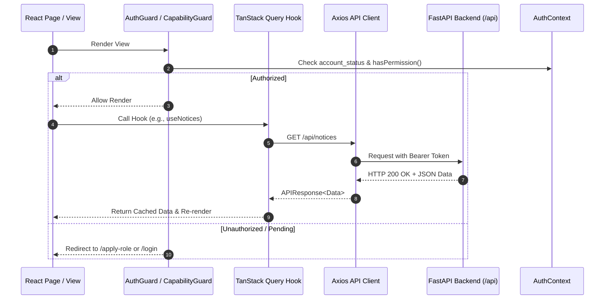

# Frontend vs. Backend Audit & Gap Analysis

Version 1.0 | October 2026 | CampusOne

---

## 1. Executive Summary

This audit compares the **currently implemented Frontend codebase (`d:\WebDev\CMS\frontend`)** against the **100% completed Backend REST API (`d:\WebDev\CMS\backend`)**.

---

## 2. Current Frontend Implementation Inventory

### Existing Frontend Pages & Components

| Page / Component | Location | Description |
| :--- | :--- | :--- |
| **Landing Page** | `src/pages/Landing.tsx` | Marketing landing page displaying campus stats, hero section, feature cards. |
| **Login Page** | `src/pages/Login.tsx` | Email/password login form with 2FA OTP modal integration. |
| **Register Page** | `src/pages/Register.tsx` | Self-service registration form creating base user accounts. |
| **Profile Page** | `src/pages/Profile.tsx` | User profile management, avatar upload, password change, notification toggles. |
| **Student Dashboard** | `src/pages/StudentDashboard.tsx` | Student portal layout with quick actions, gate pass shortcut, complaint list. |
| **Admin Dashboard** | `src/pages/AdminDashboard.tsx` | Admin control panel with metric cards and management navigation links. |
| **Role Elevation Widget** | `src/components/RoleElevationWidget.tsx` | Onboarding role application wizard for Student, Faculty, Staff, and Parent. |
| **Admin Management Pages** | `src/pages/admin/*` | Student/Faculty/Department/Course management, Role Applications queue, System Settings. |
| **Feature Views** | `src/pages/complaints/`, `notices/`, `attendance/` | Complaint submission, notice board, and attendance marker views. |

---

## 3. Feature Comparison Matrix

### A. Extra / Legacy Features in Frontend (Not in Backend Specs)

| Feature in Frontend | Current Frontend API / Route | Backend Reality & Action Plan |
| :--- | :--- | :--- |
| **Mess Menu & Opt-out** | `/api/mess/menu/today`, `/api/mess/optout`, `/api/mess/feedback` | **Legacy/Superseded:** Replaced by **Hostel Management & Room Allocation** (`/api/hostels`) and **Gate Passes** (`/api/gate-pass`). Frontend mess code should be cleaned up or repurposed for hostel meal notices. |
| **Legacy Outpasses Route** | `/api/outpasses` | **Naming Mismatch:** Backend standard is `/api/gate-pass` with QR code generation & security scanner (`/api/gate-pass/scan`). Update frontend route constants. |

---

### B. Features Supported by Backend BUT Missing Frontend UIs

| Feature | Backend API Endpoints | Missing Frontend UI Components |
| :--- | :--- | :--- |
| **1. AI Campus Assistant** | `GET/POST /api/ai/conversations` `GET/POST /api/ai/conversations/{id}/messages` | **Floating AI Chat Drawer:** Needs global collapsible chat panel with live message stream, tool execution logs, and conversation history list. |
| **2. Interactive Campus Map & Dijkstra Navigation** | `GET/POST /api/map/locations` `GET/POST /api/map/paths` `GET /api/map/route` | **Interactive Map & Route Viewer:** Needs GeoJSON floor directory viewer and walking route visualizer powered by backend Dijkstra algorithm. |
| **3. Multi-Step Document Request & Verification** | `GET/POST /api/documents/types` `GET/POST /api/documents/requests` `GET /api/documents/verify/{code}` | **Document Portal & Verification:** Needs dynamic document application form, step-by-step approval tracker, and public QR code verification page. |
| **4. Campus Placement Drives** | `GET/POST /api/placements/notices` `POST /api/placements/notices/{id}/apply` `GET /api/placements/notices/{id}/applications` | **Placement Portal:** Needs job drive board, automated eligibility check (CGPA, course, year), resume uploader, and officer shortlisting UI. |
| **5. Personal Silent Mode & iCal Calendar Feed** | `GET/PUT /api/silent/settings` `GET /api/silent/schedule` `GET /api/silent/ical.ics` | **Silent Mode & iCal Card:** Needs quiet range preference toggles (DND/Vibrate, buffers) and one-click copy iCal `.ics` feed URL for mobile calendar sync. |
| **6. Timetable Grid & Clash Detection** | `GET/POST /api/timetable/slots` `GET /api/timetable/mine` `GET/POST /api/timetable/exceptions` | **Weekly Timetable Grid:** Needs visual schedule grid with clash warning popups, substitute teacher indicators, and single-day exception overrides. |
| **7. Real-Time Security Gate Scanner** | `POST /api/gate-pass/scan` | **Security Terminal UI:** Needs camera/manual QR scanner interface for security guards at campus gates to mark exit & entry. |

---

## 4. Frontend Limitations in Current State

1. **Endpoint 404 Mismatches:**
   - Some API calls in `src/api/` target legacy endpoints (`/api/admin/students`, `/api/outpasses`, `/api/mess`) causing `404 Not Found` when triggered against the active backend.
2. **Role Hardcoding vs. Dynamic RBAC:**
   - Certain components check `user.role === 'admin'` or `user.role === 'student'` directly instead of checking backend capability permissions (`hasPermission("complaint:view")`) or `account_status` (`base`, `pending`, `active`).
3. **Incomplete Error Feedback:**
   - Validation errors from the backend are not always rendered next to input fields.
4. **Unused Metadata Endpoints:**
   - Dropdown selections in forms sometimes use hardcoded arrays instead of pulling live data from `/api/metadata/departments` and `/api/metadata/courses`.

---

## 5. How Frontend Will Consume Backend APIs

### Integration Guidelines
1. **Dynamic Dropdowns:** All role forms, notice target selectors, and timetable slot creators fetch live options from `/api/metadata/*` and `/api/academic/*`.
2. **Pre-Validation Checks:** Before submitting role applications, the frontend calls `GET /api/applications/check-identifier` to validate registration numbers or employee IDs.
3. **Single Source of State:** State is managed via TanStack Query hooks (`useQuery`, `useMutation`), ensuring automatic cache invalidation when actions occur (e.g. approving a gate pass automatically refreshes the active pass list).
4. **Maintenance Overlay:** The global Axios client catches `503 Service Unavailable` and displays a non-intrusive maintenance banner.

---

## 6. Recommended Action Plan

1. **Clean Up Endpoint Constants:** Update `src/api/` services to use the newly aligned `API_ROUTES` from `constants.ts`.
2. **Build Feature 1 (Auth & Role Applications):** Connect Login, Register, 2FA Modal, and Role Application Wizard (`/apply-role`) to live backend APIs.
3. **Build Feature 2 (Timetable & Attendance):** Implement weekly schedule grid and roster marker.
4. **Build Feature 3 (Gate Pass & Security Scanner):** Implement gate pass request forms, QR renderer, and security guard scanner interface.
5. **Build Feature 4 (Campus Map & Dijkstra Navigation):** Implement interactive GeoJSON campus map directory & Dijkstra walking router.
6. **Build Feature 5 (AI Campus Assistant):** Implement floating chat drawer with tool execution trajectory logs.
