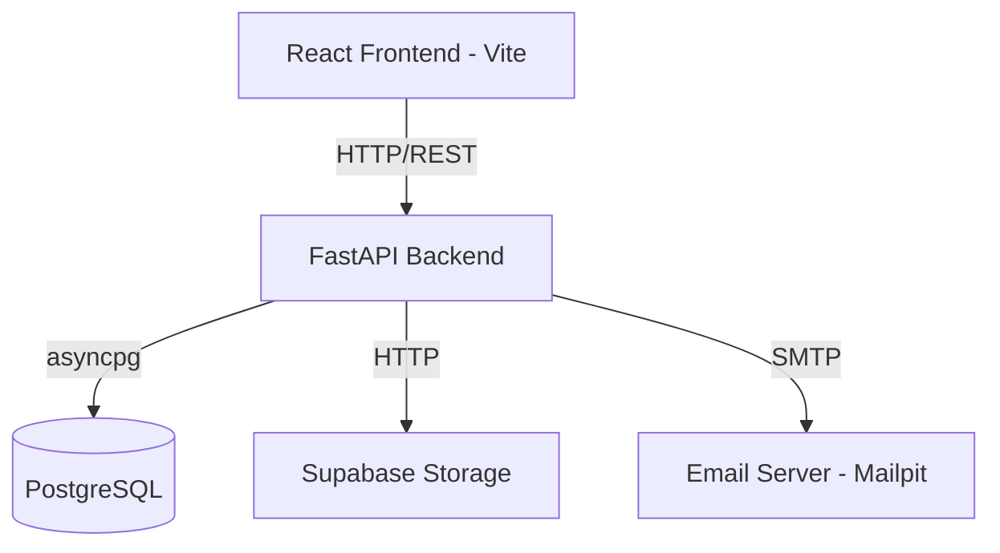

# System Architecture

## Overview
BPUT CMS is a robust, full-stack web application designed to handle university management tasks such as complaints, outpasses, and notices. It uses a decoupled architecture where a React single-page application (SPA) communicates with a Python FastAPI backend via RESTful endpoints.

## Architecture Diagram

## Components

### 1. Frontend (React/Vite)
- **Role:** Handles the User Interface, client-side routing, and state management.
- **Key Tech:** React 18, Vite, Tailwind CSS.
- **Communication:** Sends JSON payloads and multipart-form data to the Backend. Consumes JWT tokens for authentication.

### 2. Backend (FastAPI)
- **Role:** The core brain of the system. Enforces RBAC (Role-Based Access Control), validates inputs via Pydantic, and handles business logic.
- **Key Tech:** Python 3.10+, FastAPI, SQLAlchemy, Alembic (for migrations).
- **Security:** Stateless JWT authentication.

### 3. Database (PostgreSQL)
- **Role:** Relational data storage.
- **Key Tech:** PostgreSQL hosted via Supabase.
- **Interactions:** Accessed exclusively by the backend via the `asyncpg` driver for high concurrency.

### 4. File Storage (Supabase Buckets)
- **Role:** Stores large binary files such as Avatars, Complaint Evidences, and Outpass Medical Proofs.
- **Security:** `avatars` and `notice-attachments` are public. `complaint-attachments` are private and require backend-signed URLs to view.
