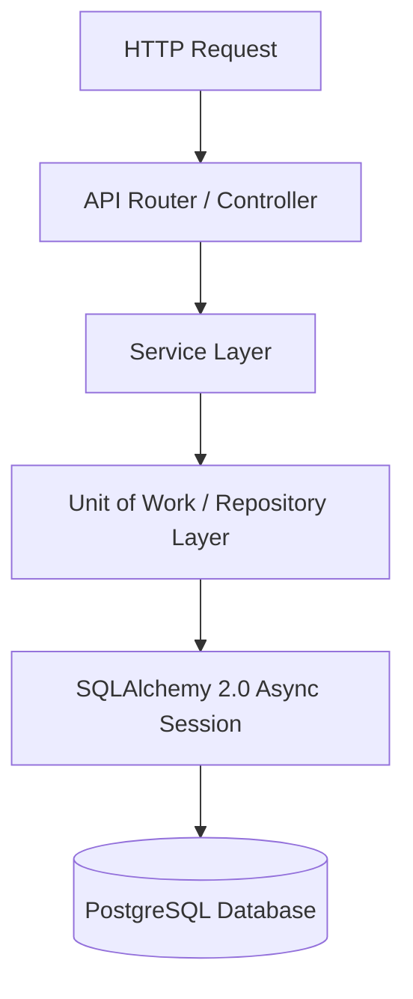

# 🏗️ CampusOne System Architecture

This document provides a comprehensive overview of the architecture, design patterns, security model, data flow, and technology stack powering **CampusOne**.

---

## 📐 High-Level Overview

CampusOne is engineered as a decoupled, multi-tier enterprise web application. It features a modern Single Page Application (SPA) frontend built with **React 18** and **TypeScript**, communicating via HTTP REST APIs with an asynchronous **FastAPI (Python)** backend, backed by **PostgreSQL**, **Supabase Storage**, and **Redis**.

```mermaid
flowchart TB
    subgraph Clients["Client Layer"]
        Browser["Web Browser (React 18 + Vite SPA)"]
        Mobile["Mobile Web App"]
    end

    subgraph API_Gateway["Backend API Layer (FastAPI)"]
        CORS["CORS & Rate Limiting Middleware (Redis)"]
        AuthMiddleware["JWT Authentication & RBAC Guard"]
        Routers["21 Domain Routers (/api/v1)"]
    end

    subgraph Business_Layer["Service & Business Logic"]
        Services["Domain Services (Academic, Auth, Complaints, GatePass, etc.)"]
        UOW["Unit of Work (Transaction Manager)"]
        Repos["Generic & Custom Repositories"]
    end

    subgraph Data_Layer["Data & Storage Layer"]
        Postgres[(PostgreSQL Database)]
        SupabaseStorage["Supabase Storage (S3 Buckets: avatars, complaints, docs)"]
        RedisCache[(Redis Cache & Limiter)]
    end

    Browser -->|HTTP/REST Bearer Token| CORS
    Mobile -->|HTTP/REST Bearer Token| CORS
    CORS --> AuthMiddleware
    AuthMiddleware --> Routers
    Routers --> Services
    Services --> UOW
    UOW --> Repos
    Repos -->|Async ORM (SQLAlchemy 2.0)| Postgres
    Services -->|Async SDK| SupabaseStorage
    CORS -->|Redis Protocol| RedisCache
```

---

## 🐍 Backend Architecture (FastAPI + SQLAlchemy 2.0)

The backend follows clean architecture principles with strict separation of concerns into **Routers**, **Services**, **Repositories**, and **Models**.



### Key Architectural Layers

1. **API Routers (`app/api/routes/`)**:
   - Thin HTTP controllers responsible only for request parsing, response formatting using standard `APIResponse[T]`, and invoking the corresponding service methods.
   - Enforces RBAC permissions via dependency injection guards (`deps.py`).

2. **Service Layer (`app/services/`)**:
   - Encapsulates all domain business logic, validation rules, state machines (e.g. Outpass approval lifecycle, Document request lifecycle), and orchestration across multiple repositories.
   - Handles external integrations such as Supabase Storage file uploads and email notifications.

3. **Repository & Unit of Work Layer (`app/repositories/`)**:
   - **`BaseRepository[T]`**: Generic repository pattern implementing reusable async CRUD operations (create, get_by_id, list, update, delete, paginate).
   - **`UnitOfWork (UOW)`**: Manages database transaction boundaries (`commit()`, `rollback()`) across operations, guaranteeing ACID compliance.

4. **Database Models (`app/models/`)**:
   - Declarative SQLAlchemy 2.0 ORM models using type-annotated Mapped attributes (`Mapped[str]`, `Mapped[int]`).
   - Managed programmatically via **Alembic** migrations.

5. **Schemas (`app/schemas/`)**:
   - Pydantic v2 schemas for strict input validation, data transformation, and API response serialization.

---

## ⚛️ Frontend Architecture (React 18 + Vite)

The frontend is designed around feature-based module organization, custom React hooks, centralized API abstraction, and component reusability.

```mermaid
graph TD
    A[User Action] --> B[React Component / Page]
    B --> C[Custom Hook / React Query Mutation]
    C --> D[Axios API Module]
    D --> E[Axios Interceptors (Auth Token Injection & Refresh)]
    E --> F[FastAPI Backend]
```

### Key Frontend Components

- **Data Fetching & Caching**: Powered by **TanStack React Query** for automatic background refetching, cache invalidation, and pagination.
- **HTTP Client**: Centralized **Axios** instance configured with request interceptors to automatically inject JWT Bearer tokens and response interceptors to handle seamless refresh token rotation upon HTTP 401 errors.
- **State Management**: **React Context API** (`AuthContext`) manages user session lifecycle, user profile state, and global authentication token storage.
- **UI Components**: Built using **Radix UI** accessible primitives styled with **Tailwind CSS** and customized **shadcn/ui** design patterns.
- **Form Handling**: **React Hook Form** paired with **Zod** schema validation for client-side form checking.
- **Routing & Protection**: **React Router v7** with `ProtectedRoute` guards checking both user authentication status and assigned system role.

---

## 🔐 Security & Access Control Architecture

CampusOne implements a robust multi-layered security model:

### 1. Authentication Engine
- **Stateless JWT Tokens**: Issues short-lived access tokens alongside long-lived refresh tokens.
- **Token Revocation List**: Blacklists revoked refresh tokens in the `revoked_tokens` database table upon logout.
- **Email OTP Verification**: 6-digit email OTPs generated for new user onboarding and password reset requests.

### 2. Custom Role-Based Access Control (RBAC)
- **Asset-Action Model**: System permissions are structured as `asset:action` strings (e.g. `outpass:approve`, `complaint:create`, `notice:broadcast`).
- **Dynamic Role Mapping**: Users are linked to system Roles (`SuperAdmin`, `Admin`, `Faculty`, `Student`, `Staff`, `Parent`), which map to granular permissions via `role_permissions`.
- **IDOR Protection**: `@verify_ownership` middleware verifies that resource IDs belong to the requesting user before allowing access or mutation.

### 3. Storage & Input Security
- **Magic Number File Inspection**: File uploads (avatars, complaint photos, medical proof attachments) are inspected using byte signatures (`python-magic-bin`) to prevent MIME-type spoofing.
- **Storage Bucket ACLs**: Public buckets (`avatars`, `complaints`) for web rendering; private buckets (`documents`) with restricted download links.

---

## 📊 Data & Storage Architecture

| System Component | Technology | Purpose |
| --- | --- | --- |
| **Relational Database** | PostgreSQL 15+ | Primary database for structured relational data (40+ models) |
| **Database ORM** | SQLAlchemy 2.0 Async (`asyncpg`) | High-performance asynchronous database access |
| **Database Migrations** | Alembic | Version-controlled schema migrations |
| **File Storage** | Supabase Storage (S3 API) | Cloud bucket storage for images and certificates |
| **Caching & Rate Limiting** | Redis | API rate limiting and transient session caching |

---
