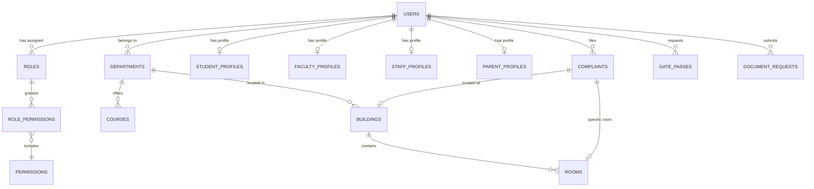

# 🗄️ Database Schema & Models Documentation

CampusOne uses **PostgreSQL** as its primary relational database. All tables, relationships, constraints, and schema migrations are managed programmatically via **SQLAlchemy 2.0** (Async Session) and **Alembic**.

---

## 📐 Entity Relationship Diagram (High-Level Summary)



---

## 🗂️ Complete Model Inventory (40+ Models across 15 Domains)

### 1. Authentication & Identity (`app/models/user.py`, `auth.py`)
- **`users`**: Base user table holding core credentials (`email`, `hashed_password`, `full_name`, `avatar_url`), active state (`is_active`, `is_verified`), and foreign keys mapping to `roles.id` and `departments.id`.
- **`revoked_tokens`**: Blacklisted JWT refresh tokens (`token_jti`, `revoked_at`, `expires_at`).
- **`password_reset_otps`**: 6-digit email OTPs for password recovery (`email`, `otp_code`, `expires_at`, `is_used`).

### 2. User Profiles (`app/models/profiles.py`)
- **`student_profiles`**: Roll number, enrollment year, degree course, section, current semester, hostel ID, room ID.
- **`faculty_profiles`**: Employee code, academic designation, research specialization, qualification, joining date.
- **`staff_profiles`**: Non-teaching staff employee code, job function/title, employment status.
- **`parent_profiles`**: Student link mapping, emergency contact phone, occupation, address.

### 3. Role-Based Access Control (RBAC) (`app/models/rbac.py`)
- **`roles`**: System roles (`SuperAdmin`, `Admin`, `Faculty`, `Student`, `Staff`, `Parent`).
- **`assets`**: Domain entity resources (`user`, `complaint`, `outpass`, `notice`, `document`, etc.).
- **`actions`**: Action verbs (`create`, `view`, `list`, `update`, `delete`, `approve`, `reject`).
- **`permissions`**: Composite permissions formatted as `asset:action`.
- **`role_permissions`**: Many-to-many junction table mapping `roles` to `permissions`.

### 4. User Onboarding & Role Applications (`app/models/application.py`)
- **`role_applications`**: Onboarding requests submitted by new registrants seeking role elevation (`user_id`, `target_role`, `application_data` JSON, `status`).

### 5. Academic Infrastructure (`app/models/academic.py`)
- **`departments`**: Hierarchical academic & administrative departments (`name`, `code`, `parent_id` self-referential FK).
- **`courses`**: Degree programs (`name`, `code`, `department_id`, `duration_years`).
- **`academic_terms`**: Semesters/Terms (`term_name`, `start_date`, `end_date`, `is_current`).
- **`subjects`**: Course subjects (`subject_name`, `subject_code`, `department_id`, `credit_hours`).
- **`class_groups`**: Student cohorts (`course_id`, `department_id`, `year_level`, `section`).
- **`holidays`**: Academic calendar holidays (`title`, `holiday_date`, `department_id` nullable for campus-wide).

### 6. Timetable & Attendance (`app/models/timetable.py`)
- **`timetable_slots`**: Weekly schedule slots (`class_group_id`, `subject_id`, `faculty_id`, `room_id`, `day_of_week`, `start_time`, `end_time`).
- **`timetable_exceptions`**: Temporary class cancellations or room swaps (`slot_id`, `exception_date`, `reason`).
- **`attendance_sessions`**: Marked class sessions (`slot_id`, `session_date`, `faculty_id`, `marked_at`).
- **`attendance_records`**: Student attendance logs (`session_id`, `student_id`, `status`: `present`/`absent`/`late`).

### 7. Campus Infrastructure & Spatial Map (`app/models/map.py`)
- **`buildings`**: Campus buildings (`name`, `code`, `building_type`, `total_floors`, `is_active`).
- **`rooms`**: Specific rooms (`building_id`, `room_number`, `floor`, `room_type`, `capacity`, `department_id`).
- **`map_locations`**: Geo/spatial map POIs (`name`, `category`, `latitude`, `longitude`, `description`).
- **`map_paths`**: Navigation paths between spatial map locations (`source_location_id`, `target_location_id`, `distance_meters`).

### 8. Hostels & Accommodation (`app/models/hostel.py`)
- **`hostels`**: Student residential hostels (`name`, `gender_type`, `warden_id`, `total_rooms`, `capacity`).

### 9. Complaints & Grievances (`app/models/complaint.py`)
- **`complaints`**: Facility & academic grievances (`title`, `description`, `category`, `priority`, `status`, `user_id`, `building_id`, `room_id`, `assigned_to`, `photo_url`).
- **`complaint_status_logs`**: Audit trail of status changes (`complaint_id`, `old_status`, `new_status`, `changed_by_id`, `remarks`).

### 10. Outpasses & Gate Security (`app/models/gate_pass.py`)
- **`gate_passes`**: Digital outpass and short exit gate passes (`student_id`, `pass_type`, `reason`, `destination`, `out_time`, `expected_in_time`, `status`, `approved_by_id`, `qr_code_hash`, `actual_out_time`, `actual_in_time`).

### 11. Document Engine (`app/models/documents.py`)
- **`document_types`**: Supported certificate types (`name`, `code`, `description`, `is_active`).
- **`document_requests`**: Certificate issuance requests (`student_id`, `document_type_id`, `purpose`, `status`, `urgency`, `attachment_url`, `issued_file_url`).
- **`document_approvals`**: Multi-stage approval log (`request_id`, `approver_id`, `stage`, `status`, `remarks`).

### 12. Placement Portal (`app/models/placement.py`)
- **`placement_notices`**: Recruitment drive announcements (`company_name`, `job_title`, `eligible_courses`, `ctc_offered`, `application_deadline`).
- **`placement_applications`**: Student applications for placement drives (`placement_notice_id`, `student_id`, `resume_url`, `status`).

### 13. Notice Board & Notifications (`app/models/notice.py`, `notification.py`)
- **`notices`**: Broadcast announcements (`title`, `content`, `author_id`, `is_important`, `target_role`, `target_department_id`).
- **`notifications`**: In-app user notifications (`user_id`, `title`, `message`, `notification_type`, `is_read`, `link_url`).

### 14. System & User Settings (`app/models/settings.py`)
- **`system_settings`**: Key-value system config (`setting_key`, `setting_value`, `category`).
- **`user_silent_settings`**: User notification and quiet hour preferences (`user_id`, `silent_mode_enabled`, `quiet_hours_start`, `quiet_hours_end`).

### 15. AI Assistant (`app/models/ai.py`)
- **`ai_conversations`**: Chat session threads (`user_id`, `title`).
- **`ai_messages`**: Chat messages (`conversation_id`, `sender_role`, `content`).

### 16. Audit Log (`app/models/audit.py`)
- **`audit_logs`**: System audit log entries (`user_id`, `action`, `resource_type`, `resource_id`, `ip_address`, `details` JSON).

---

## 🛠️ Alembic Database Migrations

All schema changes must be committed via Alembic migrations.

### Generating a New Migration
```bash
cd backend
.\venv\Scripts\activate   # (Windows)
alembic revision --autogenerate -m "Add new column to student_profiles"
```

### Applying Migrations
```bash
alembic upgrade head
```

### Rolling Back a Migration
```bash
alembic downgrade -1
```

---
