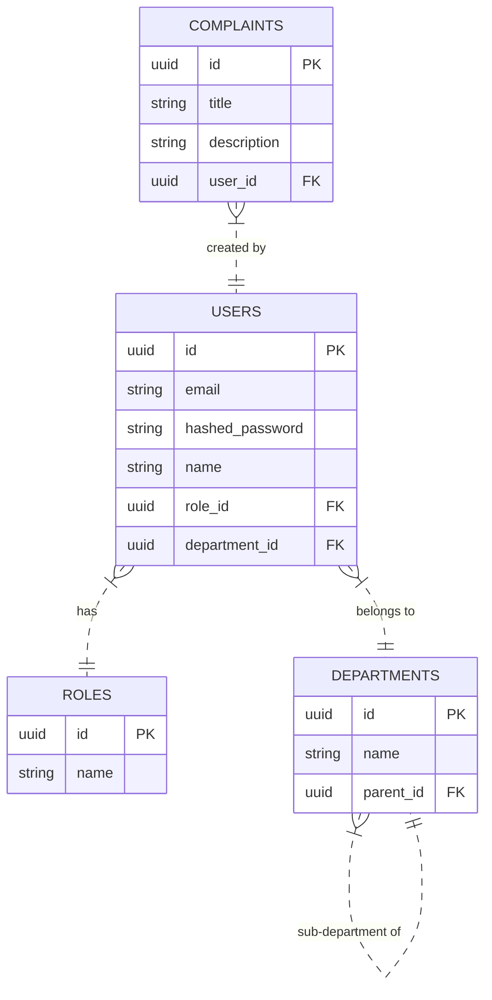

# Database Schema

The CampusOne uses PostgreSQL. All tables, relationships, and migrations are managed programmatically via **SQLAlchemy** and **Alembic**.

## Entity Relationship Diagram



## Core Tables

1. **`users`**: Stores authentication credentials, profile data, and foreign keys mapping the user to their specific Role and Department.
2. **`roles`**: Defines the system roles (e.g., SuperAdmin, Faculty, Student).
3. **`departments`**: A hierarchical table supporting nested sub-departments (using a `parent_id` self-referential foreign key).

## Migrations

We do not use raw `.sql` files or Supabase's native migration system.
Instead, we use Alembic. 

To generate a new migration after modifying a SQLAlchemy model:
```bash
alembic revision --autogenerate -m "Description of change"
```

To apply migrations:
```bash
alembic upgrade head
```
