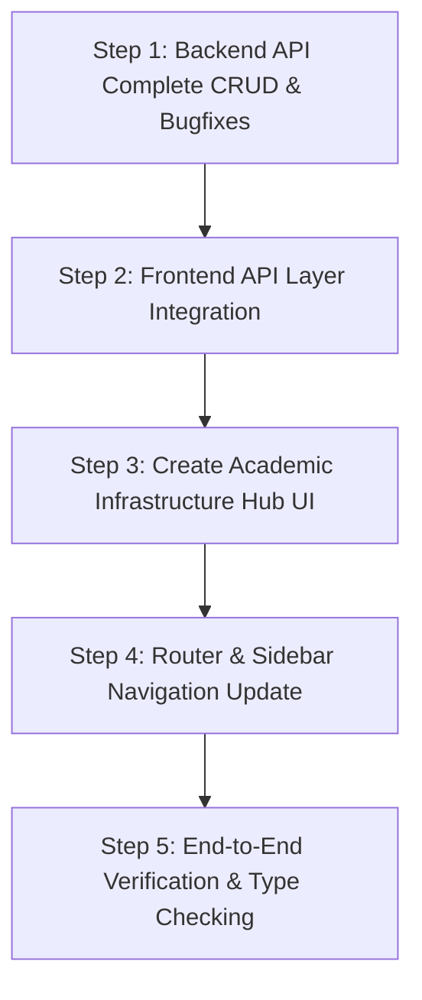

Viewed academic.py:1-294
Viewed academic_service.py:1-210
Viewed academic.py:1-294
Viewed academic_service.py:1-210
Listed directory api
Listed directory services
Searched for "/academic"
Viewed metadataApi.ts:1-20
Viewed adminApi.ts:1-159
Searched for "academic"
Listed directory admin
Viewed App.tsx:1-191
Viewed DepartmentManagement.tsx:1-295
Viewed CourseManagement.tsx:1-245

Here is a complete breakdown of how we will implement **Feature 4: Academic Infrastructure Management**, including the audit of missed/buggy APIs and a step-by-step UI/UX plan.

---

### 1. API Audit & Missed Endpoints Check

After auditing `backend/app/api/routes/academic.py`, `backend/app/services/academic_service.py`, and the frontend API mappings, here is what was found:

#### ⚠️ Gaps & Missed APIs Identified

| Entity | Documented & Existing Route | Missing / Buggy API | Root Cause & Required Fix |
| :--- | :--- | :--- | :--- |
| **Holidays** | `GET /api/academic/holidays` | Optional Date Filtering | `start_date` & `end_date` are currently marked as required `Query(...)` in `academic.py`. Calling `GET` without query parameters throws a `422 Unprocessable Entity` error. **Fix:** Make them `Optional[date] = Query(None)`, defaulting to the current calendar year. |
| **Holidays** | `POST /api/academic/holidays` | `PUT` & `DELETE` endpoints missing | Cannot update holiday details or delete a registered holiday. Need `PUT /api/academic/holidays/{id}` & `DELETE /api/academic/holidays/{id}`. |
| **Class Groups** | `GET`, `POST /api/academic/class-groups` | `PUT` & `DELETE` endpoints missing | Cannot edit cohort section/year or remove a class group. Need `PUT /api/academic/class-groups/{id}` & `DELETE /api/academic/class-groups/{id}`. |
| **Subjects** | `GET`, `POST /api/academic/subjects` | `PUT` & `DELETE` endpoints missing | Cannot edit subject credits/department or delete obsolete subjects. Need `PUT /api/academic/subjects/{id}` & `DELETE /api/academic/subjects/{id}`. |
| **Academic Terms** | `GET`, `POST`, `POST /{id}/set-current` | `PUT` & `DELETE` endpoints missing | Cannot edit semester dates or remove erroneous terms. Need `PUT /api/academic/terms/{id}` & `DELETE /api/academic/terms/{id}`. |
| **Courses** | `GET`, `POST /api/academic/courses` | `PUT` & `DELETE` endpoints missing in `academic.py` | Admin API currently routes to legacy `/api/admin/courses`. Need standard `PUT /api/academic/courses/{id}` & `DELETE /api/academic/courses/{id}` in `academic.py`. |
| **Departments** | `GET`, `POST`, `PUT /api/academic/departments` | `DELETE` endpoint missing in `academic.py` | Need `DELETE /api/academic/departments/{id}` in `academic.py`. |

---

### 2. How We Will Build This UI ("Big UI Update")

Instead of creating 6 separate, fragmented pages that clutter the admin sidebar, we will design a **Unified Academic Infrastructure Hub** (`/admin/academic` or tabbed management center), while maintaining direct sub-route URLs (`/admin/academic/departments`, `/admin/academic/terms`, etc.).

#### 🎨 UI Design Architecture & Key Features

```
┌───────────────────────────────────────────────────────────────────────────┐
│ 🏫 Academic Infrastructure Hub                                            │
│ Manage campus organizational structure, terms, subjects, and calendars     │
├───────────────────────────────────────────────────────────────────────────┤
│ [ 🏢 Departments ] [ 🎓 Courses ] [ 📅 Terms ] [ 📚 Subjects ] [ 👥 Cohorts ] [ 🎉 Holidays ] │
└───────────────────────────────────────────────────────────────────────────┘
```

1. **🏢 Departments Tab**
   - **Table Columns:** Department Name & Code, Type (Academic / Administrative), Head of Department (HOD), Status Badge (Active/Inactive).
   - **Form / Modal:** Title, Code (uppercase), Type selector, HOD Faculty dropdown (populated from `GET /api/admin/users?role=FACULTY`).

2. **🎓 Degree Courses Tab**
   - **Table Columns:** Program Name (e.g. B.Tech), Code (e.g. CSE), Duration (Years), Status Badge.
   - **Form / Modal:** Course Title, Program Code, Duration in Years (1 to 7), Active Toggle.

3. **📅 Academic Terms / Semesters Tab**
   - **Table Columns:** Term Title (e.g., "Fall 2026", "Even Semester 2026-27"), Start Date, End Date, **Current Active Term Badge**.
   - **Special Actions:**
     - **"Set as Current Active Term"** button on each row.
     - Invokes `POST /api/academic/terms/{id}/set-current`, automatically highlighting the active term with a glowing green badge and deactivating previous terms.

4. **📚 Subject Catalog Tab**
   - **Table Columns:** Subject Code (e.g., CS201), Subject Title, Department, Credit Hours (1 to 6 credits), Status.
   - **Filters:** Filter by Department dropdown.

5. **👥 Class Group Cohorts Tab**
   - **Table Columns:** Degree Course, Department, Academic Year (1st, 2nd, 3rd, 4th Year), Section (A, B, C, D), Status.
   - **Form / Modal:** Select Course & Department, enter Academic Year & Section letter.

6. **🎉 Holiday Calendar Tab**
   - **Table Columns:** Holiday Date, Occasion / Event Name, Scope (Applies to All Campus OR specific Department).
   - **Filters:** Date range picker + Department scope filter.

---

### 3. Implementation Plan & Execution Roadmap



#### Step 1: Backend API Fixes & Full CRUD (`academic.py` & `academic_service.py`)
- Add `update` and `delete` methods to `AcademicService` and `UnitOfWork` repositories for Course, Term, Subject, ClassGroup, and Holiday.
- Add `PUT` and `DELETE` routes in `backend/app/api/routes/academic.py`.
- Update `list_holidays` endpoint to accept optional `start_date` and `end_date` parameters.

#### Step 2: Frontend API Layer (`frontend/src/api/academicApi.ts`)
- Create a comprehensive `academicApi.ts` module with methods for:
  - Departments: `list`, `create`, `update`, `delete`
  - Courses: `list`, `create`, `update`, `delete`
  - Terms: `list`, `getCurrent`, `setCurrent`, `create`, `update`, `delete`
  - Subjects: `list`, `create`, `update`, `delete`
  - Class Groups: `list`, `create`, `update`, `delete`
  - Holidays: `list`, `create`, `update`, `delete`

#### Step 3: Unified Academic Infrastructure Hub Component (`frontend/src/pages/admin/AcademicManagement.tsx`)
- Build a tabbed interface using Shadcn UI `Tabs` with custom URL tab syncing.
- Integrate `ProTable` for fast sorting, multi-column search, department filtering, and CSV exporting across all 6 sections.
- Integrate `EntityViewEditDialog` for consistent view, edit, creation, and deletion modals.

#### Step 4: Routing & Navigation
- Register `/admin/academic` and sub-tab redirects in `App.tsx` and `ROLE_ROUTES`.
- Update sidebar navigation to include **Academic Infrastructure**.

#### Step 5: Verification & Quality Assurance
- Run `npx tsc --noEmit` to ensure 0 TypeScript errors.
- Run `mypy app` to verify backend typing.
- Test CRUD actions for all 6 academic resources in the UI.

---

### Next Steps

Would you like me to proceed with implementing **Step 1 (Backend API Enhancements & Missing CRUD Routes)** and **Step 2 (Frontend API Integration)** right away?